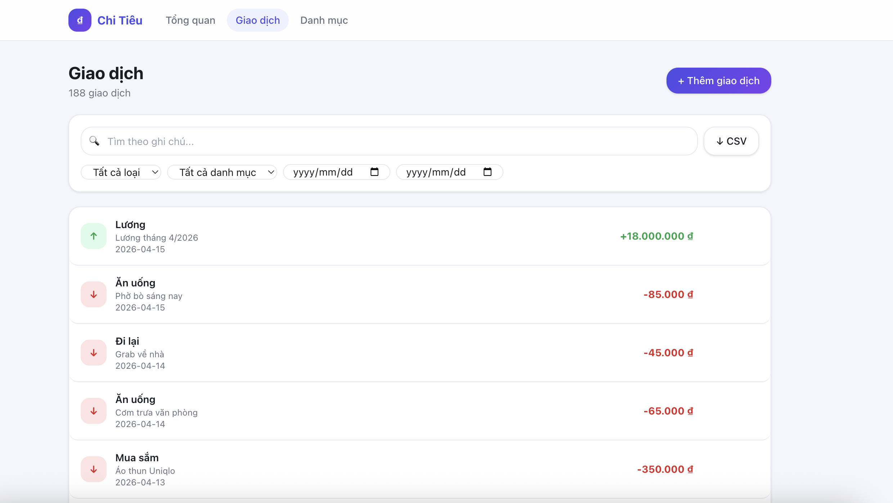
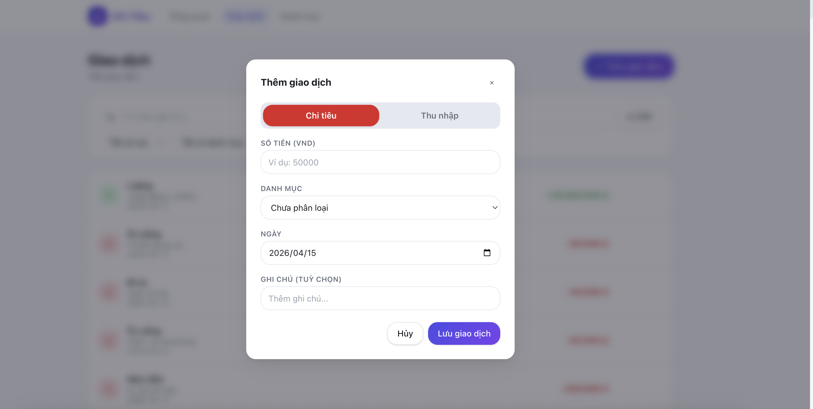
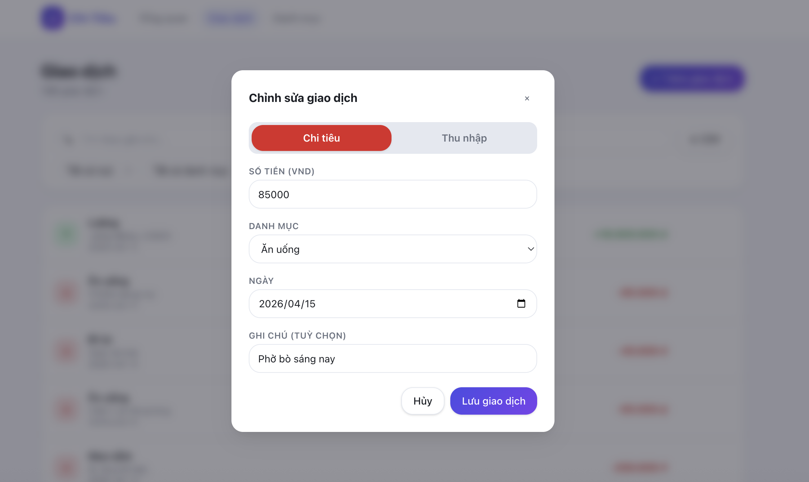
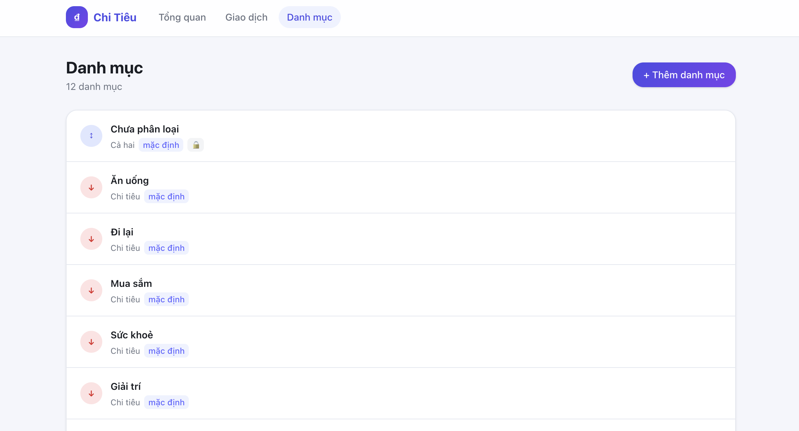
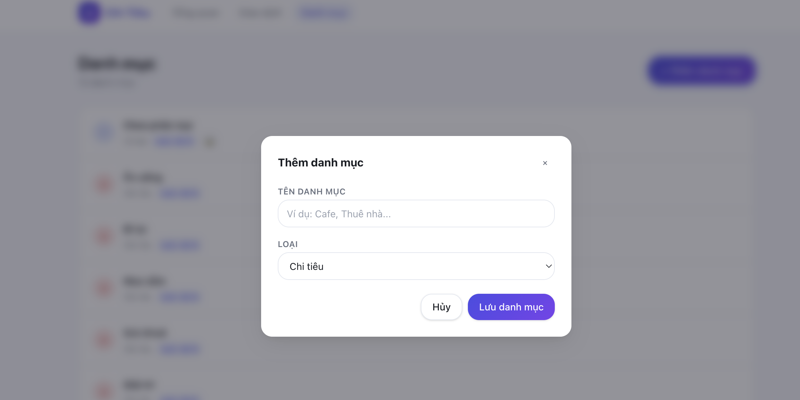

# 💰 Personal Expense Tracker

A modern, privacy-first web application for tracking personal income and expenses — no backend, no sign-up, your data stays in your browser.

Built with **Next.js 16**, **React 19**, **TypeScript 5**, and **Tailwind CSS v4**.


---

## 📸 Screenshots

### Dashboard — Tổng quan thu chi theo tháng


### Giao dịch — Danh sách & bộ lọc


### Thêm giao dịch


### Chỉnh sửa giao dịch


### Danh mục


### Thêm danh mục


---

## ✨ Features

### Core Features
- 📝 **Transaction Management** — Record income & expenses with amount, date, category, and note
- 🏷️ **Category System** — Create, edit, and delete custom categories; protected default categories
- 📊 **Dashboard** — Summary cards (income / expense / balance) with period navigation (day / week / month)
- 📈 **Category Breakdown** — Percentage bars and colour-coded category breakdown per period
- 🔍 **Search & Filter** — Filter by type, category, date range; full-text search on notes
- 📤 **CSV Export** — Export filtered transactions with UTF-8 BOM (Excel-compatible)
- 🔄 **Period Navigation** — Navigate forward/backward across days, weeks, and months

### Privacy & Storage
- 🔒 **100% Client-side** — All data stored in browser `localStorage`, zero server calls
- 🚫 **No sign-up required** — Open the app and start tracking immediately
- 🗑️ **Hard delete** — Deleted transactions are permanently removed

### Developer Experience
- 🌱 **Auto-seed** — 168 realistic transactions across 6 months loaded automatically in development
- ⚡ **Fast builds** — Static export, all routes pre-rendered
- 🧪 **42 tests** — Unit + integration tests with Jest & React Testing Library

---

## 🚀 Quick Start

### Prerequisites
- Node.js 20.x or higher
- npm

### Installation

1. **Clone the repository**
   ```bash
   git clone <your-repo-url>
   cd expense_tracker
   ```

2. **Install dependencies**
   ```bash
   npm install
   ```

3. **Start the development server**
   ```bash
   npm run dev
   ```

4. Open [http://localhost:3000](http://localhost:3000) in your browser.

> On first load in development, the app auto-seeds **168 sample transactions** across 6 months so you can explore all features immediately.

### Reset Seed Data
Open DevTools → **Application** → **Local Storage** → delete the key `expense_tracker_seeded_v2` → reload the page.

---

## 📁 Project Structure

```
expense_tracker/
├── app/                        # Next.js App Router pages
│   ├── layout.tsx              # Root layout — NavBar + SeedLoader
│   ├── page.tsx                # Redirects → /dashboard
│   ├── dashboard/page.tsx      # Dashboard: summary + period nav + breakdown
│   ├── transactions/page.tsx   # Transaction list + filter + search + export
│   ├── transactions/[id]/page.tsx  # Edit transaction
│   └── categories/page.tsx     # Category CRUD
├── components/
│   ├── ui/                     # Reusable primitives: Button, Input, Select, Modal
│   ├── transactions/           # TransactionForm, TransactionList, TransactionFilters
│   ├── dashboard/              # SummaryCards, PeriodNavigator, CategoryBreakdown
│   ├── categories/             # CategoryList, CategoryForm
│   ├── NavBar.tsx              # Sticky nav with active-link highlight
│   └── dev/SeedLoader.tsx      # Auto-seeds localStorage in development
├── lib/
│   ├── types.ts                # Shared TypeScript interfaces
│   ├── storage/                # localStorage CRUD (transactions + categories)
│   ├── utils/                  # currency, date, aggregation, CSV export
│   ├── hooks/                  # useTransactions, useCategories, usePeriod
│   └── dev/seedData.ts         # 168 seed transactions + 12 categories
├── __tests__/                  # Unit + integration tests
├── specs/001-expense-tracker-app/  # Spec-driven design docs
├── scripts/                    # Utility scripts
├── next.config.ts
├── tailwind.config (via postcss)
└── tsconfig.json
```

---

## 🎯 Usage

### Adding a Transaction
1. Navigate to **Giao dịch** (Transactions)
2. Click **+ Thêm giao dịch**
3. Fill in the form: type (income/expense), amount, date, category, note
4. Click **Lưu giao dịch**

### Viewing the Dashboard
1. Navigate to **Tổng quan** (Dashboard)
2. Switch between **Ngày / Tuần / Tháng** (Day / Week / Month)
3. Use the **‹ ›** arrows to navigate periods
4. View summary cards and per-category breakdown

### Managing Categories
1. Navigate to **Danh mục** (Categories)
2. Add custom categories; the default **Không phân loại** category cannot be deleted
3. Deleting a category with existing transactions moves them to **Không phân loại**

### Exporting Data
1. Navigate to **Giao dịch** and apply any filters
2. Click **↓ CSV** to download the filtered transactions
3. The file is UTF-8 BOM encoded — opens correctly in Excel and Google Sheets

---

## 🛠️ Development

### Available Scripts

```bash
npm run dev          # Development server → http://localhost:3000
npm run build        # Production build (TypeScript strict check included)
npm start            # Start production server
npm run lint         # ESLint
npm test             # Jest (unit + integration)
npm run test:coverage  # Jest with coverage report
```

### Data Model

All data is persisted to `localStorage` under two keys:

| Key | Type | Description |
|-----|------|-------------|
| `expense_tracker_transactions` | `Transaction[]` | All transaction records |
| `expense_tracker_categories` | `Category[]` | User + default categories |

#### `Transaction`
```ts
{
  id: string;           // crypto.randomUUID()
  type: 'income' | 'expense';
  amount: number;       // Integer VND, max 10_000_000_000
  date: string;         // 'YYYY-MM-DD'
  categoryId: string;
  note?: string;
  createdAt: string;    // ISO 8601
  updatedAt: string;    // ISO 8601
}
```

#### `Category`
```ts
{
  id: string;
  name: string;
  type: 'income' | 'expense' | 'both';
  isDefault: boolean;
}
```

---

## 🧪 Testing

```bash
npm test                    # Run all tests
npm run test:coverage       # Run with coverage
```

Tests are located in `__tests__/`:
- `unit/lib/` — Pure function tests (no DOM, no localStorage)
- `unit/hooks/` — Hook tests (`renderHook` + mocked localStorage)
- `integration/` — Component-level user-flow tests

### Key Test Coverage
- ✅ `formatVND()` — currency formatting
- ✅ `validateAmount()` — boundary validation (0, negative, > 10B)
- ✅ `aggregateByPeriod()` — totals + category breakdown
- ✅ `resolvePeriod()` / `navigatePeriod()` — date range logic
- ✅ `exportToCSV()` — UTF-8 BOM, correct columns
- ✅ `useTransactions` / `useCategories` / `usePeriod` — full hook flows

---

## 📊 Tech Stack

| Layer | Technology |
|-------|-----------|
| Framework | Next.js 16.2 (App Router) |
| Language | TypeScript 5 (strict mode) |
| UI | React 19 + Tailwind CSS v4 |
| Storage | Browser `localStorage` |
| Date handling | `date-fns` |
| Testing | Jest 30 + React Testing Library |
| Linting | ESLint 9 (`eslint-config-next`) |
| Runtime | Node.js 20 |

---

## 🌍 Deployment

This is a fully static app — no server, no database needed.

### Deploy to Vercel

```bash
# Push to GitHub, then:
# 1. Import project at vercel.com
# 2. No environment variables needed
# 3. Click Deploy
```

### Deploy to any static host
```bash
npm run build
# Upload the .next/ output (or configure output: 'export' in next.config.ts for pure static)
```

---

## 📄 License

This project is licensed under the MIT License.

---

## 🙏 Acknowledgments

- [Next.js](https://nextjs.org/) — The React Framework
- [Tailwind CSS](https://tailwindcss.com/) — Utility-first CSS
- [date-fns](https://date-fns.org/) — Modern JavaScript date utility library
- [Spec-Driven Development](https://github.com/github/spec-kit) — Workflow methodology

## Getting Started

First, run the development server:

```bash
npm run dev
# or
yarn dev
# or
pnpm dev
# or
bun dev
```


